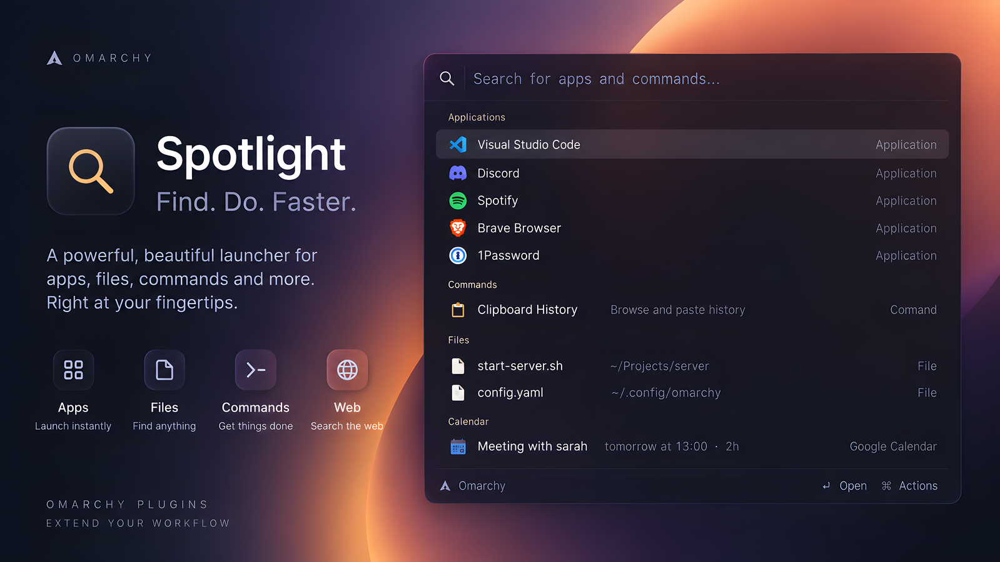

# Spotlight

A command palette for [Omarchy](https://omarchy.org/), in the shape of macOS
Spotlight and Raycast. It runs inside the existing `omarchy-shell` process, so
opening it is an IPC call into something already running rather than a cold
start.



Apps, open windows, Omarchy commands, a calculator, offline unit conversion,
natural-language reminders, calendar events, file search, clipboard history and
web search — one input, ranked so the top row is the one you meant.

## Install

```bash
omarchy plugin add https://github.com/maajix/omarchy-spotlight.git --enable
```

Omit `--enable` if you want to inspect the code before enabling the plugin.

The two optional steps below are manual changes to your Hyprland configuration.

### 1. A key to open it

In `~/.config/hypr/bindings.lua`. `CTRL + SPACE` is unbound on stock Omarchy;
pick anything you like:

```lua
o.bind("CTRL + SPACE", "Spotlight", "omarchy-shell shell toggle io.github.maajix.spotlight '{}'")
```

The payload may carry a query, so a second key can open it already primed:

```lua
o.bind("CTRL + SHIFT + SPACE", "Spotlight reminder",
  "omarchy-shell shell toggle io.github.maajix.spotlight '{\"query\":\"remind me \"}'")
```

### 2. Frosted glass (optional)

Without this the panel is simply translucent, which works fine. For the frosted
look, in `~/.config/hypr/looknfeel.lua`:

```lua
-- Blur has to be on globally before any layer rule can use it.
hl.config({
  decoration = {
    blur = { enabled = true, size = 8, passes = 3, brightness = 0.8, contrast = 0.9, new_optimizations = true },
  },
})

hl.layer_rule({
  match = { namespace = "omarchy-spotlight" },
  blur = true,
  ignore_alpha = 0.4,
})
```

Keep `ignore_alpha`: the surface is fullscreen, and the threshold limits blur
to the card. Then run `hyprctl reload`.

## Update

```bash
omarchy plugin update io.github.maajix.spotlight
```

## Uninstall

```bash
omarchy plugin remove io.github.maajix.spotlight
```

Then delete what you pasted in by hand:

- the `o.bind(...)` line in `~/.config/hypr/bindings.lua`
- the `hl.layer_rule` block for `omarchy-spotlight` in `~/.config/hypr/looknfeel.lua`
  (leave the `hl.config` blur block if anything else uses it), then `hyprctl reload`

The plugin may also leave its optional settings and local ranking history:

```bash
rm -f ~/.config/omarchy/spotlight.json            # your settings, if you wrote one
rm -f ~/.local/state/omarchy/spotlight-usage.json # launch counts, for frecency
```

## What it answers

Providers run in this order, and the top row is preselected, so Enter does the
obvious thing:

| Type this | You get |
|---|---|
| `chrom` | Applications, ranked by how well the name matches and then by frecency |
| `disc` | …plus any open window whose title or app id matches |
| `screenshot`, `lock`, `theme` | Omarchy and system commands |
| `12*7+3`, `sqrt(144)`, `20% of 250`, `15 mod 4` | Calculator — Enter copies the result |
| `10 km to miles`, `72f in c`, `5 GiB to MB` | Offline unit conversion |
| `remind me in 20m to check the oven` | Sets an `omarchy reminder` |
| `remind me tomorrow at 9 to call the dentist` | Natural times: `in 1h30`, `at 15:30`, `friday 9am`, `24.12. 10:00` |
| `reminders` | Lists what is pending, with a row to clear them |
| `meeting with sarah tomorrow at 14:00 for 90min` | Calendar event → Google Calendar, or ⇧↵ for an `.ics` file |
| `f invoice`, `~/Downloads/`, `/etc/` | File and folder search |
| `cb ssh` | Clipboard history search — Enter copies |
| `gh quickshell`, `yt lofi`, `aw hyprland` | Bang searches, below any application that also matched |
| `example.com`, `localhost:3000` | Opens the URL |
| anything else | A web-search row; optional live suggestions appear when enabled |

Bang prefixes: `g` `ddg` `yt` `gh` `w` `wde` `aw` `aur` `pkg` `so` `mdn` `npm`
`crates` `docker` `maps` `tr` `img` `hn` `omarchy`.

## Ranking

Applications are scored by the shell's own `AppSearch` — an exact name, a name
that starts with the query, a name that contains it, then the id, the keywords
and the acronym, each its own tier — and then nudged by **frecency**: the
launch count decayed by how long ago the last launch was, the way `z` and
zoxide rank directories. Two launches this morning outrank forty from last
spring.

The nudge is bounded and it saturates, so it only ever reorders apps that
matched about as well as each other. No amount of usage moves an app past one
whose name starts with what you typed — `stea` is Steam on a fresh install and
still Steam after a thousand launches of something else. On an empty query
there is no match to respect, so the list is pure frecency: your most-used apps,
most-used first.

Commands and quicklinks are ranked the same way.

## The cursor

The top row is selected, and it stays selected as the list changes underneath
it. Async rows — web suggestions, file hits — land a few hundred milliseconds
after the keystroke that asked for them, and none of them may take the cursor:
type an app name at speed and press Enter and you get the app, never the web
search that happened to be under the highlight.

The cursor only moves where you put it — `↑` `↓`, `PageUp` `PageDown`, or a
pointer that actually travelled. A pointer resting over the panel does not
count, and hover is ignored for a moment after each keystroke, because the card
resizes as results arrive and rows slide under a still mouse.

## Keys

| Key | Action |
|---|---|
| `↑` `↓`, `Ctrl+P` `Ctrl+N` | Move |
| `PageUp` `PageDown` | Move a screen |
| `↵` | Primary action, named in the footer |
| `⇧↵` / `Ctrl+↵` | Secondary action, where one exists |
| `Tab` | Complete the query with the selected app's name |
| `Esc` | Clear the query; on an empty query, close |

Log out, restart and shut down ask for a second `↵` before they act. The text
field is a real input, so `Ctrl+V`, selection and caret movement work normally.

## Settings

Optional, at `~/.config/omarchy/spotlight.json`. It is re-read every time you
open Spotlight; the plugin never writes to it.

```json
{
  "webSuggestions": false,
  "searchEngine": "g",
  "fileSearch": true,
  "maxApps": 8,
  "maxSuggestions": 4
}
```

`webSuggestions` is off by default. Enabling it sends the query to Google's
public autocomplete endpoint as you type. The regular web-search row only opens
a URL after activation. `searchEngine` accepts any bang key above and controls
that row's destination; live suggestions still come from Google.

Every value is range-checked on the way in and a bad one falls back to its
default rather than being used: `maxApps` is clamped to 3–24, `maxSuggestions`
to 0–8, `searchEngine` has to name an engine in the bang table, and the two
booleans have to be real JSON `true`/`false`.

Launch counts live in `~/.local/state/omarchy/spotlight-usage.json` — one
`{count, last}` per app, command and bang, capped at 400 entries. Delete it to
forget the ranking.

## What it talks to

| Goes out | When | Turn it off with |
|---|---|---|
| `suggestqueries.google.com` | Each query, debounced, while `webSuggestions` is on | `"webSuggestions": false` |
| Your browser, to a search or calendar URL | Only when you press Enter on such a row | — |

Everything else is local. No telemetry, no analytics, no background network.

## Requirements

Omarchy 4 (Quattro) with the Quickshell-based `omarchy-shell`. Python is required;
the other commands only provide their corresponding optional feature:

| Package | Used for |
|---|---|
| `python3` | `bin/spotlight-helper`, which brokers every file read and subprocess |
| `curl` | Web suggestions |
| `fd` | File search |
| `wl-clipboard` | The copy actions |

## Privacy and security

The plugin has no telemetry or background service. Its helper bounds file and
subprocess output, validates persistent files through directory descriptors,
refuses symlinks and unsafe ownership or permissions, and uses atomic private
writes. Subprocesses have deadlines and their process groups are cleaned up.
Clipboard contents are read only when the selected entry is copied; the shell
receives the bounded one-line preview.

## Development

`Spotlight.qml` contains the UI and actions. `lib/` contains the JavaScript
parsers and ranking logic. `bin/spotlight-helper` is the bounded interface to
files and subprocesses. Restart the shell after QML changes because the plugin
is kept loaded.

```bash
omarchy plugin validate .
python3 -m py_compile bin/spotlight-helper
/usr/lib/qt6/bin/qmlformat -n Spotlight.qml >/dev/null
for file in lib/*.js; do node --check "$file"; done
```

## License

MIT — see [LICENSE](LICENSE).

Not affiliated with Apple or Raycast.
